# flutter_keep

本项目为个人学习的 Flutter练习项目，设计参考各电商平台，基本流程可以走通。

## 预览

|     |      | 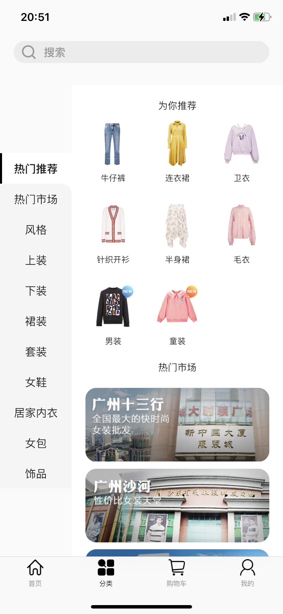   |     |
| :--------------------------------: | :---------------------------------: | :-------------------------------: | :-------------------------------:  |
| 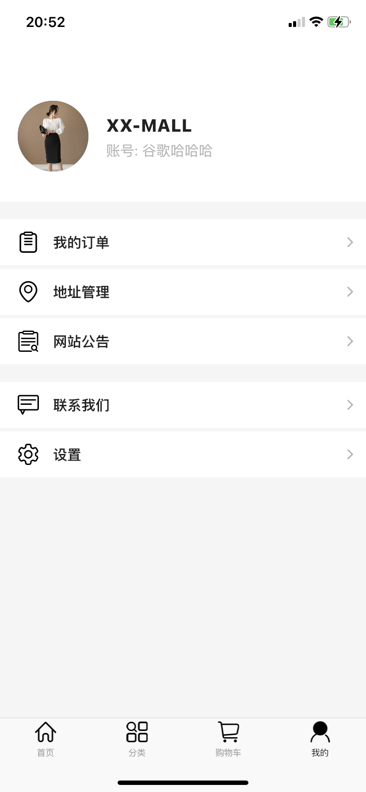    |  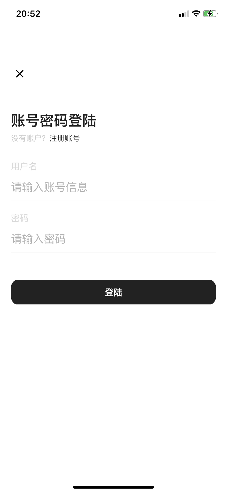    | 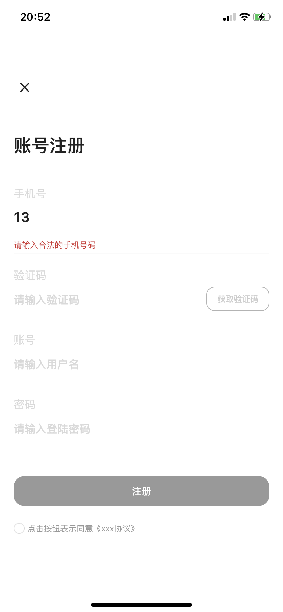   |  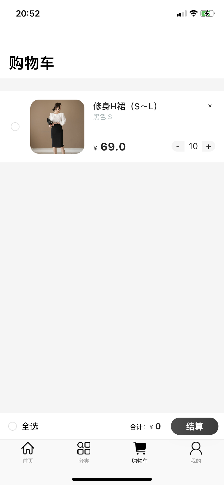   |
| 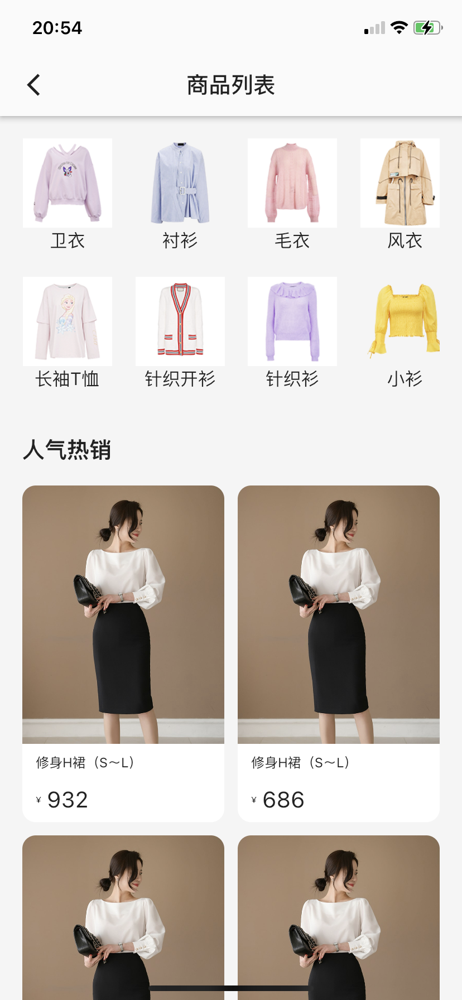    |     | 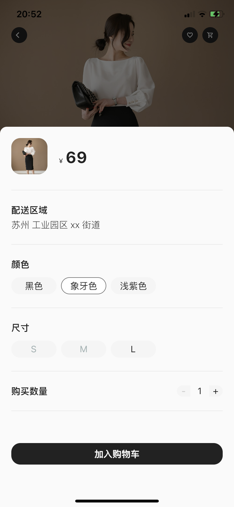  |    |
| 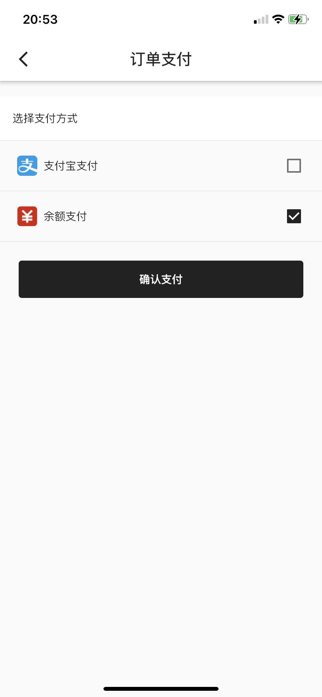   |     | 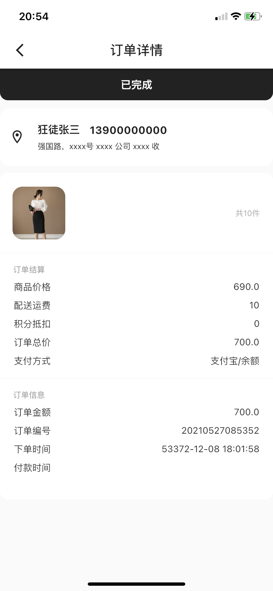  |  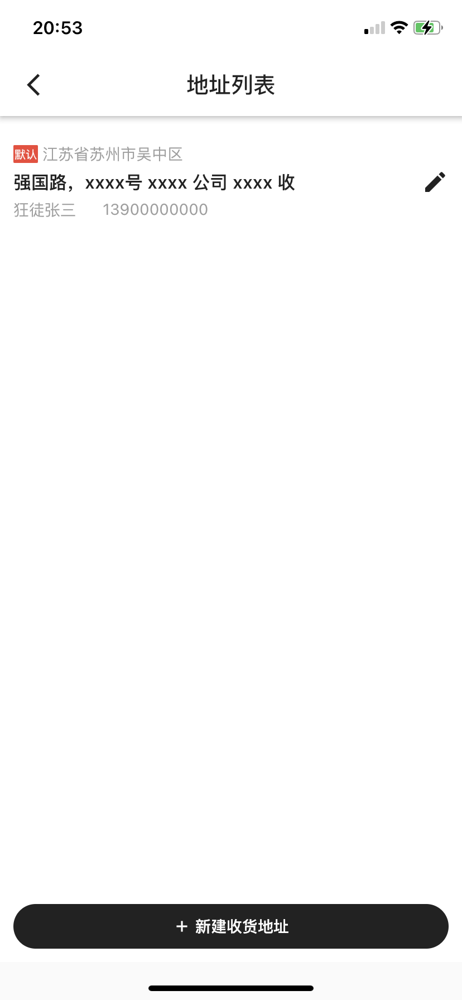  |
| 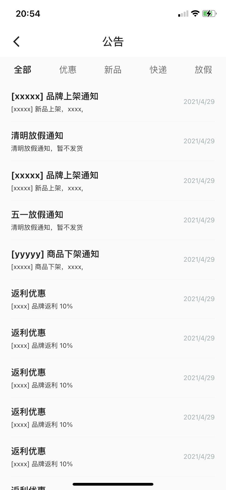   |  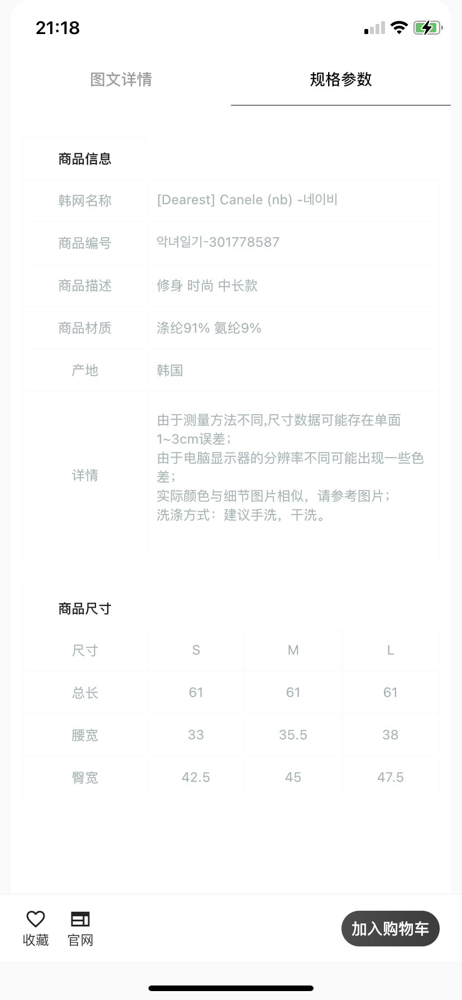   | 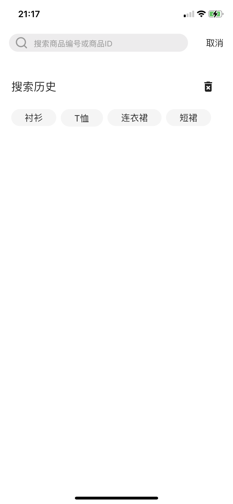  

## 实现内容

* 完整的电商购物流程
* 使用 bloc 做状态管理
* 分类页面左右动画联动
* 城市选择三级联动

具体可以下载体验：

Web体验地址：https://elon612.github.io/flutter_keep/

Android 和 iOS 可以自行下载代码运行

## 项目运行环境

    1. Flutter version 2.0.6
     
    2. Dart version 2.12.3

## 注意事项

- 本项目使用 [quicktype](https://app.quicktype.io/) 网站来生成Bean。

- Web受制于js等资源过大和部署在Github上，访问会慢一些。

## 后续计划：
 
* [ ] 细节完善。
* [ ] 添加测试。
* [ ] 升级到 2.2，支持空安全。

## Thanks For

- [flutter_deer](https://github.com/simplezhli/flutter_deer) 

- [OpenJMU](https://github.com/openjmu/OpenJMU)

